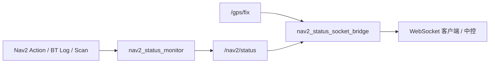

# center_control

面向 Nav2 导航系统的状态监控与远程上报工具集，用于在机器人端汇总导航状态、RTK 定位质量与障碍预警，并通过 WebSocket 将 JSON 推送给中控或上位机。

## 组件概览

| 组件 | 类型 | 说明 |
|------|------|------|
| `nav2_status_monitor` | ROS 2 包 (C++) | 订阅 Nav2 action 状态、行为树日志与激光数据，发布统一的 `Nav2Status` 消息 |
| `nav2_status_socket_bridge.py` | Python 脚本 | 将 `/nav2/status` 转为 WebSocket JSON，附带 RTK 稳定性与障碍告警音 |
| `nav2_status_socket_client.py` | Python 脚本 | WebSocket 测试客户端，用于调试 bridge 输出 |

## 数据流



## 依赖

### ROS 2 包 (`nav2_status_monitor`)

- `rclcpp`
- `nav2_msgs`
- `action_msgs`
- `sensor_msgs`
- `std_msgs`

### Python 脚本

```bash
pip install websockets
```

告警音播放需要系统已安装 `aplay` 或 `paplay`（ALSA / PulseAudio）。

## 编译

将 `src/nav2_status_monitor` 放入 ROS 2 工作空间后编译：

```bash
cd ~/RTK_ws
colcon build --packages-select nav2_status_monitor
source install/setup.bash
```

## 使用

### 1. 启动状态监控节点

```bash
ros2 launch nav2_status_monitor nav2_status_monitor_launch.py
```

常用启动参数：

| 参数 | 默认值 | 说明 |
|------|--------|------|
| `config_file` | 包内 `config/nav2_status_monitor.yaml` | 参数文件路径 |
| `status_topic` | `/nav2/status` | 输出话题 |
| `publish_period_sec` | `2.0` | 周期性状态汇总间隔（秒），设为 `0` 可关闭 |

### 2. 启动 WebSocket 桥接

```bash
python3 nav2_status_socket_bridge.py
```

或仅运行 RTK 监控（不转发 WebSocket）：

```bash
python3 nav2_status_socket_bridge.py --gps-monitor
```

常用 ROS 参数（`--ros-args -p key:=value`）：

| 参数 | 默认值 | 说明 |
|------|--------|------|
| `status_topic` | `/nav2/status` | 订阅的 Nav2 状态话题 |
| `socket_mode` | `server` | `server`：本机监听；`client`：连接远端 WebSocket 服务 |
| `socket_host` | `0.0.0.0` | 监听地址（server）或远端地址（client） |
| `socket_port` | `9091` | WebSocket 端口 |
| `ws_path` | `/nav2/status` | WebSocket 路径 |
| `reconnect_interval_sec` | `2.0` | client 模式断线重连间隔 |
| `gps_topic` | `/gps/fix` | GPS 话题 |
| `obstacle_alert_enabled` | `true` | 障碍失败时播放告警音 |
| `obstacle_wav_path` | `alarm/obstacle.wav` | 告警音频文件 |
| `rtk_log_period_sec` | `10.0` | RTK 状态日志周期（秒），`0` 关闭 |

RTK 稳定性判定参数：

| 参数 | 默认值 | 说明 |
|------|--------|------|
| `rtk_window_seconds` | `30.0` | 滑动窗口时长 |
| `rtk_min_hz` | `5.0` | 窗口内最低有效频率 |
| `rtk_max_speed` | `0.4` | 允许的最大等效速度 (m/s) |
| `rtk_speed_margin` | `1.5` | 速度容差倍数 |
| `rtk_jump_buffer` | `0.15` | 位置跳变缓冲 (m) |
| `rtk_dynamic_speed_threshold` | `0.05` | 触发动态跳变检测的速度阈值 |

示例（server 模式，修改端口）：

```bash
python3 nav2_status_socket_bridge.py --ros-args \
  -p socket_port:=9090 \
  -p socket_host:=0.0.0.0
```

### 3. 测试 WebSocket 输出

```bash
python3 nav2_status_socket_client.py --host 127.0.0.1 --port 9091 --path /nav2/status
```

## Nav2Status 消息

话题：`/nav2/status`（`nav2_status_monitor/msg/Nav2Status`）

| 字段 | 类型 | 说明 |
|------|------|------|
| `nav2_available` | `bool` | Nav2 action server 是否可达 |
| `navigation_state` | `string` | `unavailable` / `idle` / `accepted` / `executing` / `succeeded` / `canceled` / `aborted` / `canceling` |
| `task_source` | `string` | 主任务来源：`none` / `follow_waypoints` / `navigate_to_pose` / `navigate_through_poses` |
| `task_status` | `string` | 主任务状态 |
| `subtask_source` | `string` | `follow_waypoints` 执行中的子导航任务 |
| `subtask_status` | `string` | 子任务状态 |
| `current_waypoint` | `int32` | 当前航点索引，不适用时为 `-1` |
| `in_recovery` | `bool` | 是否处于恢复行为 |
| `recovery_count` | `uint16` | 恢复次数 |
| `failure_category` | `string` | 失败类别，如 `planning` / `control` |
| `failure_detail` | `string` | 失败详情，如 `obstacle_ahead` / `follow_path_failed` / `no_path_to_goal` |
| `failed_bt_node` | `string` | 失败的行为树节点名 |
| `active_behaviors` | `string[]` | 当前活跃的行为 |

### 前方障碍提前检测

`nav2_status_monitor` 可订阅 `/scan`，在 FollowPath 正式失败前根据前方扇区距离提前上报 `obstacle_ahead`。相关参数见 `config/nav2_status_monitor.yaml`：

- `early_obstacle_detection`：是否启用
- `obstacle_ahead_distance`：触发距离 (m)
- `obstacle_ahead_clear_distance`：解除告警距离 (m)
- `obstacle_ahead_half_angle_deg`：前方扇区半角 (deg)

## WebSocket JSON 格式

bridge 在 ROS 消息基础上增加 `rtk_status` 字段（`bool`，表示 RTK 是否在窗口内稳定）：

```json
{
  "stamp": { "sec": 0, "nanosec": 0 },
  "frame_id": "",
  "nav2_available": true,
  "navigation_state": "executing",
  "task_source": "follow_waypoints",
  "task_status": "executing",
  "subtask_source": "navigate_to_pose",
  "subtask_status": "executing",
  "current_waypoint": 2,
  "in_recovery": false,
  "recovery_count": 0,
  "failure_category": "",
  "failure_detail": "",
  "failed_bt_node": "",
  "active_behaviors": [],
  "rtk_status": true
}
```

当 `failure_category` 为 `control` 且 `failure_detail` 为 `obstacle_ahead` 或 `follow_path_failed` 时，bridge 会播放 `alarm/obstacle.wav` 告警音（可通过参数关闭）。

## 目录结构

```
center_control/
├── README.md
├── nav2_status_socket_bridge.py   # WebSocket 桥接 + RTK 监控
├── nav2_status_socket_client.py   # WebSocket 测试客户端
├── alarm/
│   └── obstacle.wav               # 障碍告警音频（需自行放置）
└── src/
    └── nav2_status_monitor/       # ROS 2 状态监控包
        ├── msg/Nav2Status.msg
        ├── config/nav2_status_monitor.yaml
        ├── launch/nav2_status_monitor_launch.py
        └── src/nav2_status_monitor.cpp
```

## 许可证

`nav2_status_monitor` 包采用 Apache-2.0 许可证。
