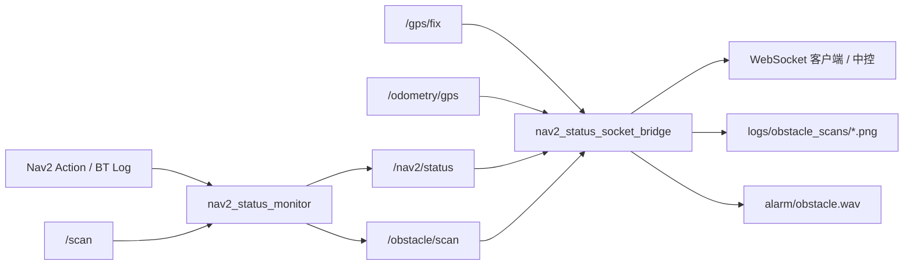

# center_control

面向 Nav2 导航系统的状态监控与远程上报工具集，用于在机器人端汇总导航状态、RTK 定位质量、激光障碍与路径失败，并通过 WebSocket 将 JSON 推送给中控或上位机。

## 组件概览

| 组件 | 类型 | 说明 |
|------|------|------|
| `nav2_status_monitor` | ROS 2 包 (C++) | 订阅 Nav2 action 状态、行为树日志与激光，发布 `Nav2Status` 与 `/obstacle/scan` |
| `nav2_status_socket_bridge.py` | Python 脚本 | 将 `/nav2/status` 转为 WebSocket JSON；RTK 监控；障碍语音与 2D 快照 |
| `nav2_status_socket_client.py` | Python 脚本 | WebSocket 测试客户端 |

**说明**：工作空间内请使用 **`RTK_ws/src/nav2_status_socket_bridge.py`**（最新版）。`center_control/nav2_status_socket_bridge.py` 为旧副本，功能未同步，请勿混用。

## 数据流



## 依赖

### ROS 2 包 (`nav2_status_monitor`)

- `rclcpp`, `nav2_msgs`, `action_msgs`, `sensor_msgs`, `std_msgs`

### Python 脚本

```bash
pip install websockets numpy matplotlib
```

- **WebSocket**：`websockets`
- **障碍 2D 快照**：`numpy`, `matplotlib`（与 `save_scan_xy.py` 相同）
- **告警音**：系统需安装 `aplay` 或 `paplay`（ALSA / PulseAudio），且在运行 bridge 的机器上可用

## 编译

```bash
cd ~/RTK_ws
colcon build --packages-select nav2_status_monitor
source install/setup.bash
```

## 使用

### 1. 启动状态监控节点

```bash
ros2 launch nav2_status_monitor nav2_status_monitor_launch.py
```

| 参数 | 默认值 | 说明 |
|------|--------|------|
| `config_file` | 包内 `config/nav2_status_monitor.yaml` | 参数文件 |
| `status_topic` | `/nav2/status` | 输出话题 |
| `publish_period_sec` | `0.5` | 周期性心跳（秒），`0` 关闭 |

### 2. 启动 WebSocket 桥接

```bash
python3 ~/RTK_ws/src/nav2_status_socket_bridge.py
```

仅 RTK 监控（不转发 WebSocket）：

```bash
python3 ~/RTK_ws/src/nav2_status_socket_bridge.py --gps-monitor
```

### 3. 测试 WebSocket

```bash
python3 ~/RTK_ws/src/nav2_status_socket_client.py --host 127.0.0.1 --port 9091
```

---

## Nav2Status 消息

话题：`/nav2/status`（`nav2_status_monitor/msg/Nav2Status`）

| 字段 | 类型 | 说明 |
|------|------|------|
| `nav2_available` | `bool` | Nav2 action server 是否可达 |
| `navigation_state` | `string` | `idle` / `executing` / `succeeded` 等 |
| `task_source` | `string` | `follow_waypoints` / `navigate_to_pose` 等 |
| `task_status` | `string` | 主任务状态 |
| `subtask_source` / `subtask_status` | `string` | 子导航任务（follow_waypoints 时） |
| `current_waypoint` | `int32` | 当前航点，不适用为 `-1` |
| `in_recovery` | `bool` | 是否处于 recovery |
| `recovery_count` | `uint16` | recovery 次数 |
| `failure_category` | `string` | `planning` / `control` 等（最近一次主失败） |
| `failure_detail` | `string` | `obstacle_ahead` / `follow_path_failed` 等 |
| `failed_bt_node` | `string` | 失败 BT 节点 |
| **`obstacle_ahead_active`** | **`bool`** | **激光前方障碍（独立标志）** |
| **`follow_path_failed_active`** | **`bool`** | **FollowPath 失败（独立标志，可与上者同时为 true）** |
| `active_behaviors` | `string[]` | 当前 recovery 行为 |

### 激光障碍检测（monitor）

配置见 `config/nav2_status_monitor.yaml`：

| 参数 | 默认 | 说明 |
|------|------|------|
| `early_obstacle_detection` | `true` | 启用 `/scan` 提前检测 |
| `scan_topic` | `/scan` | 原始激光话题 |
| `obstacle_ahead_distance` | `3.0` | 触发距离 (m) |
| `obstacle_ahead_clear_distance` | `3.5` | 解除距离 (m)，滞回区 3.0–3.5 m |
| `obstacle_ahead_half_angle_deg` | `15.0` | 前方扇区半角 (deg) |
| `obstacle_ahead_confirm_scans` | `5` | 连续 N 帧 ≤ 触发距离才置 `obstacle_ahead_active` |
| `obstacle_ahead_clear_confirm_scans` | `2` | 连续 N 帧 > 解除距离才清除 |
| `obstacle_scan_topic` | `/obstacle/scan` | 过滤后的障碍激光话题 |

**检测与语音前提差异**：

- Monitor：`accepted` / `executing` / `canceling` 均可检测
- Bridge 语音与 JSON `*_active`：仅 `task_status == executing`

**FollowPath 失败**：BT `FollowPath FAILURE` 或 `recovery_count++` 置 `follow_path_failed_active`；`FollowPath SUCCESS` 清除。

### `/obstacle/scan`

`obstacle_ahead_active == true` 时，按 yaml 扇区与距离过滤后发布（非障碍点置 `inf`）：

- 扇区：\|angle\| ≤ `obstacle_ahead_half_angle_deg`
- 距离：≤ `obstacle_ahead_clear_distance`（含滞回区内的点，便于可视化）

---

## WebSocket JSON

在 ROS 消息基础上增加：

| 字段 | 说明 |
|------|------|
| `rtk_status` | RTK 30 s 窗口内是否稳定 |
| `gps_hz` | `/odometry/gps` 实时频率 |
| `obstacle_ahead_active` | `executing ∧ obstacle_ahead_active` |
| `follow_path_failed_active` | `executing ∧ follow_path_failed_active` |
| `obstacle_ahead_detail` / `obstacle_ahead_bt_node` | 激光障碍拆分字段 |
| `follow_path_failed_detail` / `follow_path_failed_bt_node` | FollowPath 拆分字段 |

示例：

```json
{
  "task_status": "executing",
  "obstacle_ahead_active": true,
  "follow_path_failed_active": false,
  "failure_detail": "obstacle_ahead",
  "rtk_status": true,
  "gps_hz": 10.0
}
```

---

## 障碍语音与 2D 快照（bridge）

### 激光通道（默认开启）

前提：`task_status == executing` 且 `obstacle_ahead_active == true`

| 参数 | 默认 | 说明 |
|------|------|------|
| `obstacle_alert_enabled` | `true` | 总开关 |
| `obstacle_wav_path` | `src/alarm/obstacle.wav` | 告警音频 |
| `obstacle_alert_repeat_interval_sec` | `10.0` | 同一 episode 重复间隔（自上次**开始**播放起算） |
| `obstacle_ahead_repeat_hold_sec` | `0.5` | 第 2 次起 episode 最短持续 |
| `obstacle_long_episode_play_sec` | `10.0` | 长 episode milestone |
| `obstacle_voice_clear_grace_sec` | `3.0` | 障碍消失后 grace 内 episode 不清零 |

**播放节奏（wav ≈ 4.3 s，interval = 10 s）**：

- 第 1 次：检测到 active 后立即播
- 之后：约每 **10 s** 一次（播完后再静音约 **5.7 s**）
- 障碍消失 ≥ **3 s** 后 episode 清零，再次出现视为新 episode

### Recovery 通道（默认关闭）

| 参数 | 默认 |
|------|------|
| `follow_path_failed_alert_enabled` | `false` |

### 障碍 2D 快照

每次**激光语音触发**时，用最新 `/obstacle/scan` 生成 XY 散点图：

| 参数 | 默认 |
|------|------|
| `obstacle_scan_image_enabled` | `true` |
| `obstacle_scan_topic` | `/obstacle/scan` |
| `obstacle_scan_image_dir` | `src/logs/obstacle_scans` |

文件名：`YYYYMMDD_HHMMSS_mmm.png`（播放时刻；同毫秒冲突时加 `_1` 后缀）

### Bridge 常用参数

| 参数 | 默认 | 说明 |
|------|--------|------|
| `socket_mode` | `server` | `server` / `client` |
| `socket_port` | `9091` | WebSocket 端口 |
| `ws_path` | `/nav2/status` | WebSocket 路径 |
| `gps_topic` | `/gps/fix` | GPS 话题 |
| `odometry_gps_topic` | `/odometry/gps` | 里程计 GPS（算 hz） |

RTK 参数：`rtk_window_seconds`（30）、`rtk_min_hz`（5）、`rtk_max_speed`（0.4）等。

示例：

```bash
python3 ~/RTK_ws/src/nav2_status_socket_bridge.py --ros-args \
  -p socket_port:=9091 \
  -p obstacle_alert_repeat_interval_sec:=10.0 \
  -p obstacle_scan_image_dir:=/home/cdf/RTK_ws/src/logs/obstacle_scans
```

---

## 已知问题与排查

| 现象 | 原因 / 处理 |
|------|-------------|
| 日志有 `Playing laser obstacle alert` 但无声 | 运行 bridge 的机器上 `aplay`/`paplay` 不可用或无声卡；手动 `aplay src/alarm/obstacle.wav` 排查 |
| 语音比预期更密 | 旧版 monitor 解除无确认帧导致 `obstacle_ahead_active` 闪烁 + episode 被 grace 清零；需 rebuild monitor 并确认 yaml 中 `clear_confirm_scans: 2` |
| 存图失败 `need numpy/matplotlib` | `pip install numpy matplotlib` |
| `No /obstacle/scan message cached` | 语音早于首帧障碍 scan；通常仅首次偶发，确保 monitor 已启动且 `early_obstacle_detection: true` |
| JSON 有障碍但无语音 | `task_status` 非 `executing`（仍在 `accepted`） |
| `failure_detail` 与 bool 不一致 | `failure_detail` 为最近一次主失败；FollowPath 失败时可能覆盖显示，但 `obstacle_ahead_active` 仍可单独为 true |

---

## 目录结构

```
RTK_ws/src/
├── nav2_status_socket_bridge.py   # 主 bridge（请用此文件）
├── nav2_status_socket_client.py
├── alarm/obstacle.wav
├── logs/obstacle_scans/           # 障碍 2D 快照（运行时生成）
└── center_control/
    ├── README.md
    ├── nav2_status_socket_bridge.py   # 旧副本，勿用
    └── src/nav2_status_monitor/
        ├── msg/Nav2Status.msg
        ├── config/nav2_status_monitor.yaml
        ├── launch/nav2_status_monitor_launch.py
        └── src/nav2_status_monitor.cpp
```

## 许可证

`nav2_status_monitor` 包采用 Apache-2.0 许可证。
